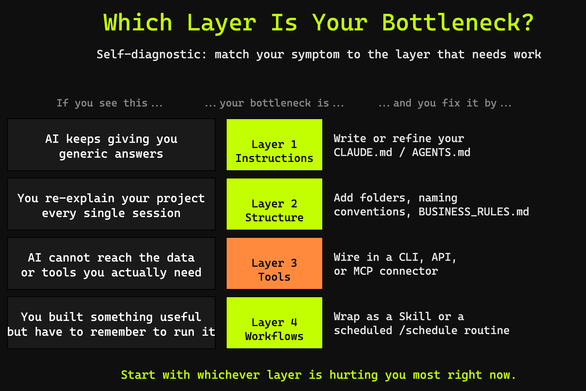
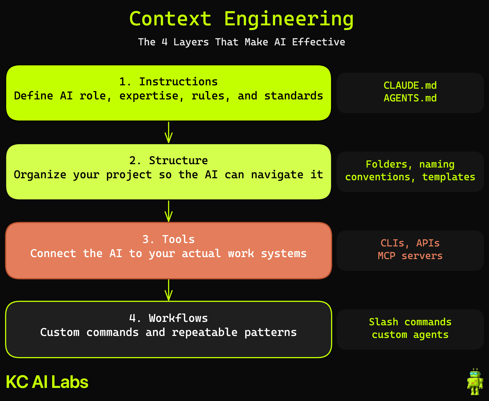

# Channel Patterns Analyzer

A scheduled Claude Code analyzer that reads YouTube channel metrics from BigQuery, identifies what's actually working on the channel (controlled for video age and small samples), and publishes a weekly report to Notion.

**Built live as part of:** [The 4 Layers of Context Engineering (Make AI Actually Useful)](https://www.youtube.com/@kylechalmersdataai) — a KC Labs AI video that teaches the 4-layer Context Engineering framework (Instructions, Structure, Tools, Workflows) through one sustained build.

This repo is the companion to the video. Watching is not required — the README is self-contained.

---

## Which layer is your bottleneck?

Before you read further, here's a quick self-diagnostic. If AI keeps failing you in one of these ways, that's the layer to invest in first.



This repo demonstrates all four layers in one sustained build. Pick a layer you're stuck on and read its section first.

---

## The 4 layers, embodied

Every file in this repo is an exhibit of one of the four layers:

| Layer | What it is in this repo |
|---|---|
| **1. Instructions** | `CLAUDE.md` — the analyzer's operating brain (voice, rules, hedging guidance). Committed as the reference version; viewers who run Prompt 1 will draft their own and overwrite it. |
| **2. Structure** | `BUSINESS_RULES.md` (imported from CLAUDE.md via `@BUSINESS_RULES.md`) + folder layout (`sql/`, `scripts/`, `images/`) |
| **3. Tools** | BigQuery (`bq` CLI) for the data source; Notion (local MCP for terminal sessions + Claude web connector for cloud routines) for the output destination |
| **4. Workflows** | The build pattern (GSD-driven planning, AI as doer + Kyle as project manager) + a Claude Code Skill (`write-notion-report`) + a scheduled `/schedule` routine that runs the analyzer every Monday at 9am Phoenix time |

Without all four, this would be a chatbot. With all four, it runs without me.

---

## Architecture



Data flow:

```
┌──────────────────────────────────┐
│       Claude Code Routine        │
│   (/schedule, weekly @ Monday)   │
└────────────────┬─────────────────┘
                 │
                 ▼
   ┌─────────────────────────┐
   │  Analyzer (this repo)   │
   │  • CLAUDE.md → voice    │
   │  • BUSINESS_RULES.md    │
   │  • bq CLI → BigQuery    │
   └────┬────────────────┬───┘
        │                │
        ▼                ▼
┌──────────────┐  ┌──────────────────┐
│   BigQuery   │  │  write-notion-   │
│ youtube_     │  │  report Skill    │
│ analytics    │  │  → Notion page   │
│ (4 tables)   │  │                  │
└──────────────┘  └──────────────────┘
```

---

## Prerequisites

| Tool / service | Purpose | Setup |
|---|---|---|
| **Claude Code** | The AI agent that runs the analyzer | [claude.ai/download](https://claude.ai/download) |
| **Google Cloud + BigQuery** | Data source | Need an existing `youtube_analytics`-style dataset. If you don't have one, the [youtube-bigquery-pipeline](https://github.com/kyle-chalmers/youtube-bigquery-pipeline) repo builds it for you. Free tier covers it. |
| **`gcloud` CLI** | Authentication | `gcloud auth login` then `gcloud config set project <your-project>` |
| **`bq` CLI** | Querying BigQuery | Comes with the Google Cloud SDK |
| **Notion account** | Output destination | Free tier fine for a single page |
| **Notion MCP** (terminal use) | Local Claude Code → Notion | See [notion.com/integrations](https://www.notion.com/integrations) |
| **Notion Claude connector** (cloud routines) | Scheduled runs → Notion | Configure in your [Anthropic account](https://claude.com) under Connectors |
| **GSD framework** (optional) | Workflow scaffolding for the build | `claude` then ask it to install GSD |

**No BigQuery yet?** See the [CSV fallback](#csv-fallback-for-non-bigquery-users) section below — you can follow along with a sample dataset.

---

## Setup

### 1. Clone and configure

```bash
git clone https://github.com/kyle-chalmers/channel-patterns-analyzer.git
cd channel-patterns-analyzer
cp .env.example .env
# Edit .env: set BQ_PROJECT, BQ_DATASET, NOTION_REPORT_PAGE_ID, and DATA_SOURCE
```

### 2. Install Python dependencies (only needed for the CSV fallback path)

```bash
pip install -r requirements.txt
```

### 3. Verify BigQuery access

The SQL files in `sql/` reference the dataset by its bare name (`youtube_analytics.video_metadata` etc.) because the **project** comes from your active gcloud config, not from the SQL. Set your project before running queries:

```bash
gcloud config set project "$BQ_PROJECT"
bq query --use_legacy_sql=false \
  "SELECT COUNT(*) FROM \`${BQ_DATASET:-youtube_analytics}.video_metadata\` WHERE snapshot_date = CURRENT_DATE()"
```

If your dataset has a name other than `youtube_analytics`, update the SQL files (one-line replace) or have the analyzer template the dataset name from `BQ_DATASET` when it queries.

### 4. Configure Notion — both ways

The video demos two paths because cloud routines and terminal sessions see different surfaces:

- **Local MCP** (terminal sessions): your local Claude Code talks to Notion via an MCP server. The exact install command depends on the current Notion MCP distribution (check [notion.com/integrations](https://www.notion.com/integrations) — at recording time, verify with `claude mcp add notion <official-url-or-npx-cmd>` against current docs).
- **Web connector** (scheduled routines): in your Anthropic account at [claude.com](https://claude.com), go to Connectors → add Notion. Cloud routines see this; they do NOT see your local MCP config.

### 5. Scheduling: cloud setup ≠ local setup

If you're running the analyzer locally, the steps above are enough. If you want to wrap it as a scheduled routine, the cloud environment is its own thing:

- Routines run on Anthropic's infrastructure, not your laptop.
- They need: the repo selected, environment variables defined per-routine, the Notion Claude connector (web), and BigQuery credentials that work without your local `gcloud` login (e.g., a service account key passed via env var).
- See the [Anthropic routines docs](https://code.claude.com/docs/en/routines) for the cloud-env configuration screen.

A routine that "works locally" will fail in the cloud if any of the above isn't scoped. Verify in the Anthropic UI before the routine's first scheduled fire.

### 6. (Optional) Install GSD to follow the video's build flow

```bash
claude
> "Install the GSD framework globally on this machine. Walk me through what you are doing as you do it."
```

---

## Demo prompt

The whole analyzer is built via a sequence of prompts inside Claude Code with GSD. The full prompt list is in the companion video (link in the description after the video publishes).

Quick start (Prompt 5 in the video):

```text
/gsd:new-project a YouTube channel pattern analyzer. Connect to my youtube_analytics
dataset in Google BigQuery via the bq CLI. Tables: video_metadata, daily_video_stats,
daily_video_analytics, daily_traffic_sources. Join on (video_id, snapshot_date).
Run AI analysis with the system prompt in CLAUDE.md, respecting the business rules
in BUSINESS_RULES.md. Write the report to my channel-patterns Notion page. The plan
should include creating a write-notion-report Skill that the analyzer calls — the
Skill encapsulates the Notion write logic so the analyzer just hands it a report
and lets the skill handle the rest. Also include a data-health check as the first
step of the analyzer: for each analytics table, surface the latest snapshot date
and flag any table that has not been refreshed in the last 3 days so the report
always tells me when upstream data is stale. Hedge on small samples.
```

GSD will interview you, plan the build in 4 phases, and execute each phase as you confirm.

---

## CSV fallback for non-BigQuery users

If you don't have a BigQuery dataset set up, the `scripts/csv_fallback_loader.py` script generates a sample dataset that mimics the `youtube_analytics` schema. The analyzer can read from CSV files instead of BigQuery — useful for following along without setting up the full data pipeline.

```bash
python scripts/csv_fallback_loader.py
```

This creates `sample_data/` with the same schema as the BigQuery tables, sized to be representative without being huge.

To make the analyzer use CSVs instead of BigQuery, set `DATA_SOURCE=csv` in your `.env` AND, when you're prompting GSD to build the analyzer, add:

> "Respect the DATA_SOURCE environment variable. If it is `csv`, read from `./sample_data/*.csv` instead of querying BigQuery. The CSV schemas match the BQ table schemas exactly. If it is `bigquery` (or unset), query BigQuery as normal."

The analyzer will then take both paths in its planning + execution.

---

## Repo layout

```
channel-patterns-analyzer/
├── README.md                    ← you are here
├── LICENSE                      ← MIT
├── BUSINESS_RULES.md            ← Layer 2 — stable analysis rules (imported from CLAUDE.md via @)
├── PROMPTS.md                   ← the 10 prompts that build the analyzer (follow along here)
├── CLAUDE.md                    ← Layer 1 — analyzer voice + reasoning rules (the reference draft from Prompt 1)
├── .env.example                 ← config template
├── .gitignore
├── requirements.txt
│
├── .internal/                   ← gitignored — Kyle's personal config + recording notes
│
├── sql/                         ← sample BigQuery queries (read-only patterns the analyzer uses)
│   ├── 01_latest_snapshot_overview.sql
│   ├── 02_top_full_length_videos.sql
│   ├── 03_age_controlled_performance.sql
│   └── 04_data_health_check.sql
│
├── scripts/                     ← utility scripts
│   └── csv_fallback_loader.py   ← generate sample data for non-BQ users
│
├── images/
│   ├── diagram.excalidraw       ← 4-layer Context Engineering (architecture)
│   ├── diagram.png              ← rendered + KC Labs branded
│   ├── diagram-decision-tree.excalidraw  ← which layer is your bottleneck?
│   └── diagram-decision-tree.png
│
└── (gitignored — built during the video, not committed)
    ├── .claude/skills/write-notion-report/SKILL.md   ← the Skill built on camera
    ├── routine_config.json      ← /schedule routine config
    └── sample_data/             ← generated CSV fallback data
```

After the video, fork this repo and run through the prompts yourself — you'll generate your own versions of all four live-built artifacts.

---

## Related KC Labs AI resources

- **AZ Tech Week Workshop materials** (the foundation this video builds on) — [data-ai-tickets-template/videos/az_tech_week_workshop](https://github.com/kyle-chalmers/data-ai-tickets-template/tree/main/videos/az_tech_week_workshop). Includes the fillable Context Engineering playbook template + starter CLAUDE.md template + curated resource guide.
- **YouTube BigQuery Pipeline** (the data source) — [github.com/kyle-chalmers/youtube-bigquery-pipeline](https://github.com/kyle-chalmers/youtube-bigquery-pipeline). Builds the `youtube_analytics` dataset this analyzer reads from.
- **KC Labs AI YouTube channel** — [youtube.com/@kylechalmersdataai](https://www.youtube.com/@kylechalmersdataai)

---

## Authoritative reading on Context Engineering

- Anthropic, [Effective context engineering for AI agents](https://www.anthropic.com/engineering/effective-context-engineering-for-ai-agents)
- Andrej Karpathy, [on context engineering](https://x.com/karpathy/status/1937902205765607626)
- Simon Willison, [Context engineering](https://simonwillison.net/2025/jun/27/context-engineering/)
- Drew Breunig, [How Long Contexts Fail](https://www.dbreunig.com/2025/06/22/how-contexts-fail-and-how-to-fix-them.html) — the four failure modes
- Dex Horthy (HumanLayer), [Advanced Context Engineering for Coding Agents](https://github.com/humanlayer/advanced-context-engineering-for-coding-agents)
- Kyle Mistele (HumanLayer), [Writing a good CLAUDE.md](https://www.humanlayer.dev/blog/writing-a-good-claude-md)

## Claude Code features used

- [CLAUDE.md and the `@` import syntax](https://code.claude.com/docs/en/memory)
- [Claude Code Skills](https://code.claude.com/docs/en/agents-and-tools/agent-skills/)
- [Claude Code Routines (`/schedule`)](https://code.claude.com/docs/en/routines) — shipped April 14, 2026

---

## License

MIT — see [LICENSE](./LICENSE). Fork it, adapt it, ship your own version.

---

*Made with Claude Code.*
